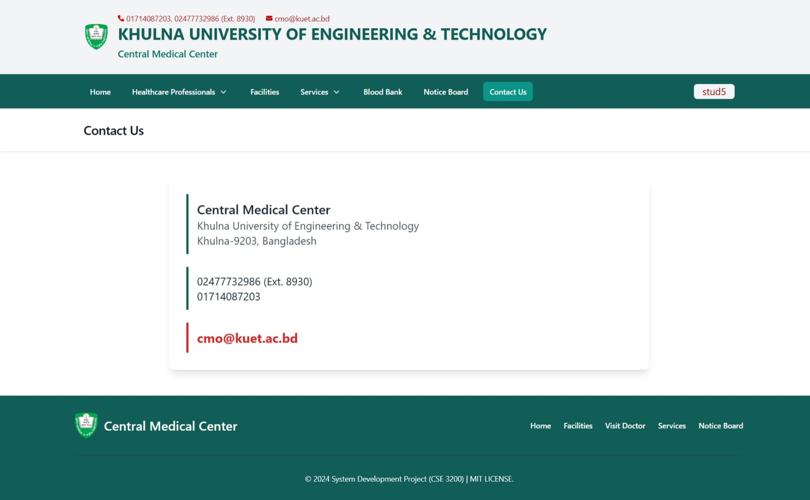

## Website Preview  
#### Home Page

#### Healthcare Professionals

#### Facilities

#### Services

#### Notice Board

##### Contact

### Authentication and Verification

#### User Registration 

#### Login 

#### Email Verification

### Admin Panel

#### Admin Dashboard

#### Add Information

#### Edit Information

